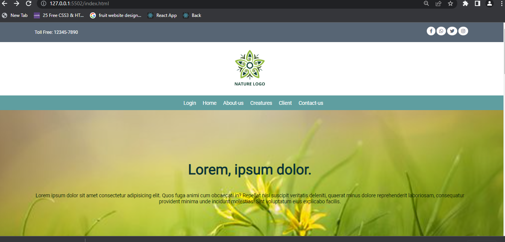
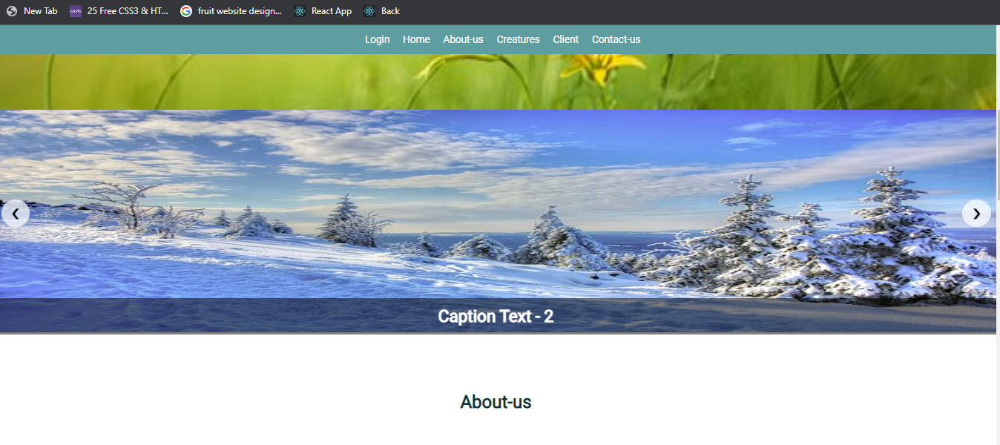
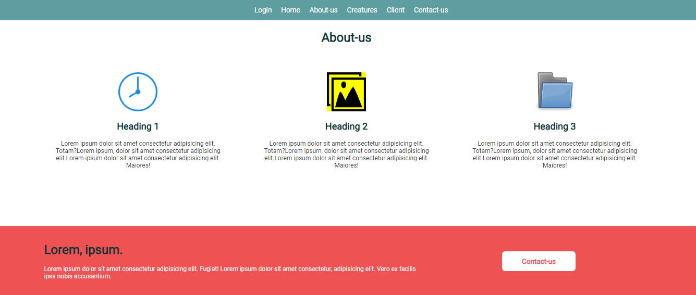
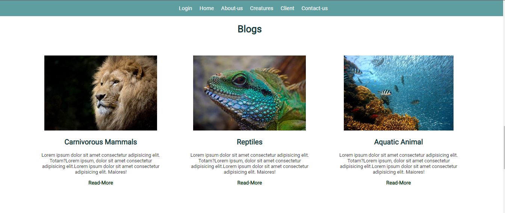
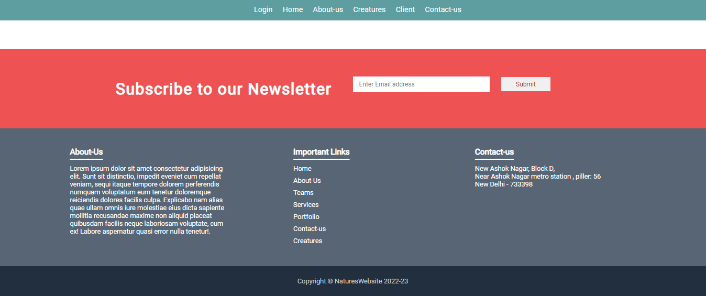
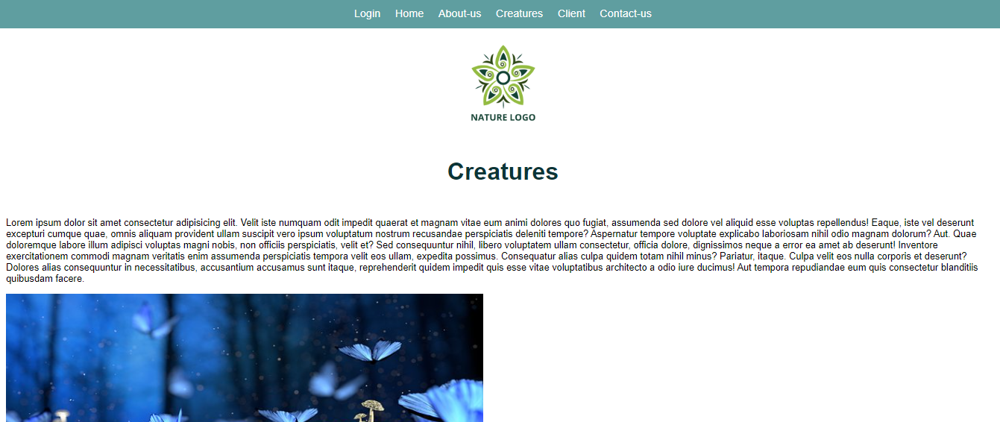
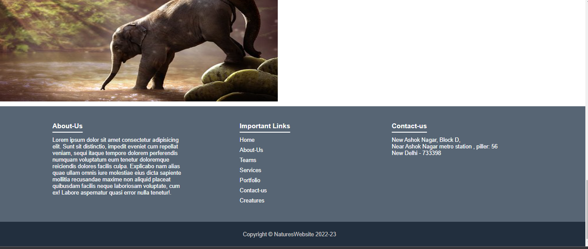
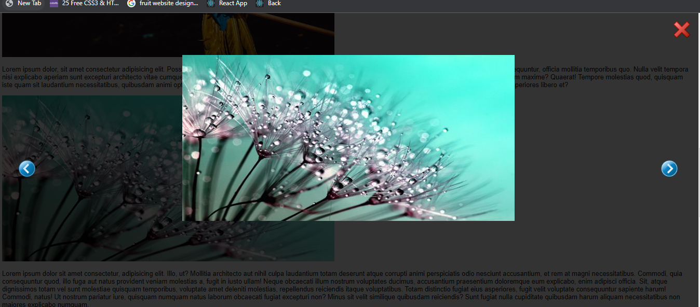
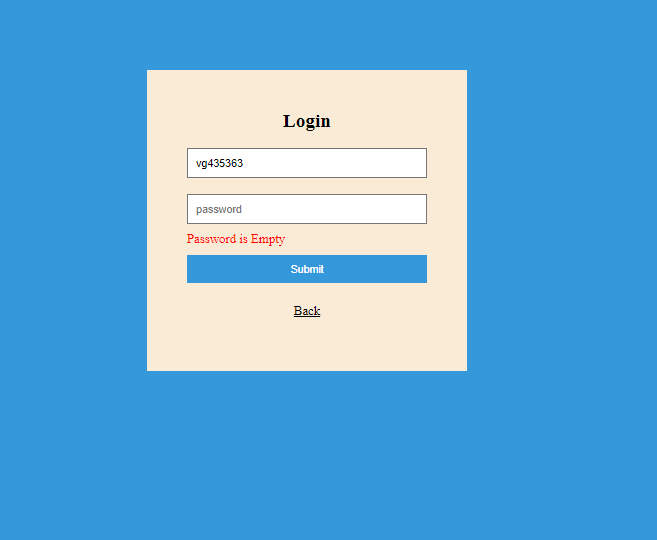
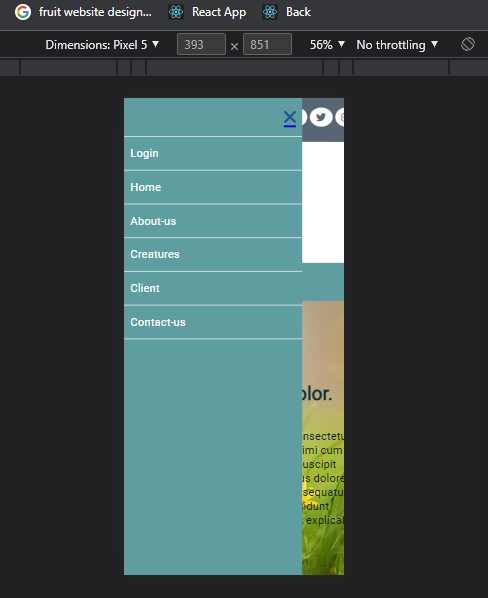

# Dynamic Website.

## Poject Desrciption:

Dynamic Website is a web Application  made of using pure JavaScript's  with HTML & CSS. In this application have Sticky Navbar on Scrolling below, including Favicons, on button click slide Show of images was there. It has many sections including About us, contact us, header, footer, blog sections etc. on navbar login and Creatures & home links are active when click on any link it will redirect on that page. In login page there in login section to let user login it have only validation. on creatures page we have many images when click on that images it will popup .In this project mainly focused on CSS.This Website is fully Mobile responsive. 

## Technology Used:

- JavaScript :- JavaScript is the Programming Language for the Web. JavaScript can update and change both HTML and CSS. JavaScript can calculate, manipulate and validate data.
- HTML: Hyper Text Markup Language is the standard markup language for creating Web pages, describes the structure of a Web page it consists of a series of elements that tell browser how to display the content.
- CSS: CSS is the language we use to style an HTML document & describes how HTML elements should be displayed.

## What I've Learnt :
- HTML how to write Html, learn different tags etc.
- How to apply CSS with class and Id. and their syntax.
- How to make fully responsive website using media Query.
- Writing clean, structure Consistence code.
- Validation in login form.
- How to add Image Slider.
- proper website structure.
- how to debug and identifying error and also resolve it.
- proper CSS without using float, and not play with max to max margin & padding.
- Mobile Responsive website.

## Getting Started with Project

### `To start`

One Can use Live server. to run this project.
Live Server: It enables us to right-click an HTML document, and it runs a server for us and opens a browser window with the file in it. Any changes we make to the file causes the browser to reload and we can immediately see them. 

### Home - Page
Home Screen

- This is main Home page including navbar, Icon etc.

Home Page Slider Section

- when click on forward arrow button it slides to show next image with caption text also.

About/Contact-us-Section

- when scroll down thier is About-us & contact-us sections. and navbar get stick up.

Blogs-Section

- when scroll down thier is Blogs sections.

Footer-Section

- when scroll down thier is Footer sections.

### Creatures - Page
Creatures-Page 

- when click on creatures link in navbar it will redirect on this page.

- Footer of Creatures Page.

Creatures-Slider

- when click on any image on creatures page that image will popup and user can able to see all images on creatures page by clicking on forward and backward buttons.

### Login- Page
Login
 
- it include validation for empty fields.

### Mobile Responsive

## Project Deployed
https://sticky-website-881a6.web.app

